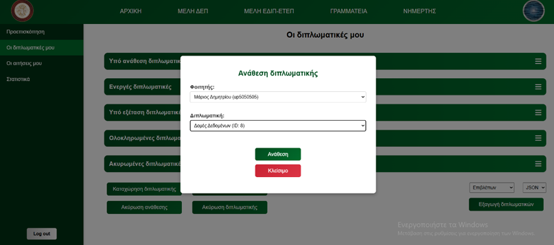
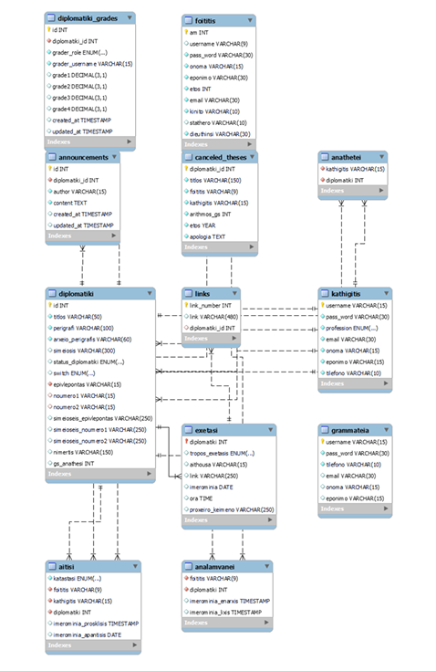

# 🎓 University Thesis Management System

> A comprehensive web platform for managing the entire lifecycle of university theses from assignment to final grading.


## 📄 About The Project
This web application was developed to digitize and streamline the thesis management process for university departments. It serves as a central hub where all stakeholders - Students, Professors, and Secretaries can collaborate efficiently.

The system replaces manual paperwork with a digital workflow, allowing users to:
* **Assign & Manage:** Professors can create and assign topics, accept student applications, grade theses
* **Track Progress:** Students can upload drafts and receive feedback, schedule the thesis exam
* **Administration:** Secretaries have full oversight of pending, active and rejected theses and officialy finalize them.

## 🛠️ Tech Stack
* **Frontend:** HTML5, CSS3, JavaScript (Vanilla)
* **Backend:** PHP (Native)
* **Database:** MySQL
* **Data Visualization:** Chart.js (used for statistics)

## 🌟 Key Features

### 👨‍🎓 For Students
* **Browse & Apply:** View available professors and submit applications to them to become members of their thesis.
* **Progress Tracking:** Upload drafts, links, and notes for professor review.
* **Exam Status:** View scheduled presentation dates and check final grades.

### 👨‍🏫 For Professors
* **Thesis Creation:** Create new thesis topics and assign them to students.
* **Student Management:** Accept or reject applicants and manage supervised students.
* **Grading System:** Input final grades and view statistics/averages automatically calculated by the system.

### 🏛️ For Secretaries
* **User Management:** Manually register new professors and students into the system.
* **Oversight:** Overview theses, cancel assignments, or handle special requests.
* **Announcements:** Post department-wide announcements visible to all users.

## 📂 Project Structure
The codebase is structured to separate logic (PHP), webpages (HTML), styling (CSS), and interactivity (JS):

```text
├── css/                  # Styling for specific user roles (foititis.css, kathigitis.css, etc.)
├── html/                 # User Interface and views (Login forms, Dashboard layouts)
├── js/                   # Frontend logic (AJAX calls, form validation, charts)
├── php/                  # Backend logic (Authentication, Database connection, CRUD operations)
│   ├── database.php      # Database connection configuration
│   ├── auth_check.php    # Middleware to check user login status
│   └── ... (API endpoints)
└── uploads/              # Storage for uploaded thesis drafts and notes
```

## 📸 Screenshots
* Professor Theses Page


* Thesis Assignment



* Database Schema



## 🚀 How to Run Locally

Since this project uses Native PHP and MySQL, you will need a local server environment (like **XAMPP** or **WAMP**) to run it.

1.  **Clone the repository:**
   ```bash
   git clone [https://github.com/vasizaf/University-Thesis-Manager-Web-App.git](https://github.com/vasizaf/University-Thesis-Manager-Web-App.git)
   ```
  
2.  **Move the folder:**
    * Copy the project folder.
    * Paste it inside your local server's root directory:
        * **XAMPP:** `C:\xampp\htdocs\`
        * **WAMP:** `C:\wamp64\www\`

3.  **Setup the Database:**
    * Open phpMyAdmin (usually `http://localhost/phpmyadmin`).
    * Create a new database named `thesis_db` (⚠️ Check your `php/database.php` file to confirm the exact name expected).
    * Import the `.sql` file provided in this repo to create the necessary tables.

4.  **Configure Connection:**
    * Open the `php/database.php` file.
    * Ensure the `$username` (usually `root`) and `$password` (usually empty for XAMPP) match your local server setup.

5.  **Run the App:**
    * Start Apache and MySQL in XAMPP/WAMP.
    * Open your browser and visit: `http://localhost/thesis-management-system/html/login.html`

## 👥 Contributors

This project was designed and built as a group assignment for the **[University of Patras]** Computer Engineering and Informatics Department.

* **[Vasileios Zafeiris]** - *[Student & Professor (secondarily) Logic, HTML, CSS]*
* **[Ioannis Grigoropoulos]** - *[Professor Logic, MySQL]* - [GitHub Profile](https://github.com/Nolzok)
* **[Alkis Chatzopoulos]** - *[Secretary Logic]* - [GitHub Profile](https://github.com/AlkisChatz)

---
Note: This project is for educational purposes and demonstrates full-stack CRUD capabilities without the use of high-level frameworks.
